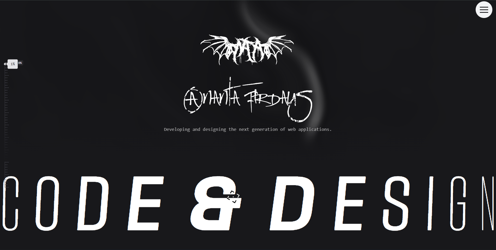

<div align="center">


  # 🌐 Ananta-TI Portfolio v2.0
  **Interactive • Immersive • Awwwards-Inspired**

  <p>
    <a href="https://ananta-ti.vercel.app/">
      
    </a>
    <a href="https://github.com/Ananta-TI/Web-React">
      
    </a>
    
  </p>

  <p align="center">
    Website portofolio eksperimental yang mendorong batas kemampuan <b>React</b> & <b>Framer Motion</b>.
    <br />
    Fokus pada <i>Liquid Transitions</i>, <i>Micro-interactions</i>, dan <i>Typography-driven Design</i>.
  </p>
</div>


 
> **Live Demo:** [https://ananta-ti.vercel.app/](https://ananta-ti.vercel.app/)

Portofolio interaktif dan modern yang dirancang untuk mendemonstrasikan kemampuan Frontend Development tingkat lanjut. Project ini menggabungkan animasi fluid, transisi halaman yang mulus (seamless), dan desain responsif menggunakan teknologi web terkini.

Dibuat dengan fokus pada **User Experience (UX)**, **Performance**, dan **Micro-interactions**.

---

## 🛠️ Tech Stack & Tools

Dibangun di atas fondasi ekosistem modern untuk menjamin stabilitas dan kecepatan.

| Area | Teknologi | Kenapa dipilih? |
| :--- | :--- | :--- |
| **Framework** |   | Ekosistem komponen terbaik & Hot Module Replacement instan. |
| **Styling** |  | Rapid UI development dan konsistensi sistem desain. |
| **Motion** |  | Library animasi paling deklaratif untuk React (Exit transitions, Layout animations). |
| **Scroll** |  + **Lenis** | Standar industri untuk scroll-based animation dan smooth scrolling. |
| **Deploy** |  | CI/CD otomatis dan Edge Network yang cepat. |

---

## ✨ Fitur Utama & Keunggulan Komponen

### 1. 🎬 Cinematic Preloader (Awwwards Style)
Fitur unggulan yang memberikan kesan pertama yang premium.
 **Curtain Reveal Effect:** Menggunakan **SVG Path Morphing** untuk menciptakan efek tirai "cair" yang ditarik ke atas, memberikan transisi yang sangat halus (liquid motion) saat website dimuat.
* **Multi-language Greeting:** Menyapa pengguna dengan animasi teks dalam 16 bahasa berbeda sebelum konten utama muncul.
* **Smart Loading Logic:** Sistem cerdas yang menggunakan `SessionStorage` agar preloader hanya muncul pada kunjungan pertama (fresh load), sehingga tidak mengganggu navigasi berulang.
* **Anti-Scroll Locking:** Mencegah pengguna melakukan scroll saat loading berlangsung untuk menjaga integritas visual.

### 2. 🖱️ Interaksi & Navigasi (UX)
* **Custom Target Cursor:** Kursor kustom dengan efek magnetik dan indikator visual yang berputar, memberikan feedback interaktif saat pengguna melakukan hover pada elemen penting.
* **GSAP Smooth Scroll (Lenis):** Menggantikan scroll default browser yang kaku dengan scroll berbasis inersia (momentum) yang lembut, membuat pengalaman menjelajah halaman panjang menjadi sangat nyaman.
* **Scroll Progress Bar:** Indikator visual di sisi layar yang menunjukkan posisi baca pengguna secara real-time.

### 3. 🌓 Dynamic Theming (Dark/Light Mode)
* Menggunakan `ThemeContext` global untuk mengelola state tema.
* Transisi warna yang halus (`duration-500`) pada background dan teks.
* Komponen seperti **Preloader** dan **About** secara otomatis menyesuaikan palet warna (fill SVG, text color) agar konsisten dengan tema yang dipilih pengguna.

## 4. 📄 Halaman & Komponen Khusus

### 🦸 Hero Section
- Tipografi besar, bold, dan kontras
- Fokus pada identitas personal
- Entry animation berbasis opacity + transform

### 🔠 Text Pressure Effect
- Typography responsif terhadap posisi mouse
- Distorsi berbasis transform matrix
- Menjadikan teks sebagai elemen interaktif, bukan statis

### 👤 About Section
- Layout minimalis dan fokus konten
- Adaptive background sesuai theme
- Menjaga readability meski animasi aktif

### 💼 Projects & All Projects
- Grid system fleksibel
- Hover reveal untuk metadata
- Modal detail dengan scroll-locking
- Background freeze saat modal aktif

### 📊 Scanner & Experimental Visuals
- Elemen visual sci-fi inspired
- CSS animation + transform intensive
- Demonstrasi eksplorasi kreatif frontend

### 🕒 Timeline & Certificates
- Visualisasi kronologis
- Scroll-triggered animation
- Modal certificate dengan UX overlay yang proper

---

## 🚀 Optimasi Performa
Website ini bukan hanya soal visual, tapi juga performa:
1.  **Code Splitting:** Menggunakan Vite untuk memecah bundle JavaScript agar loading awal cepat.
2.  **Asset Optimization:** Penggunaan format gambar modern (AVIF/WebP).
3.  **Vercel Speed Insights:** Monitoring Core Web Vitals secara real-time.
4.  **Clean Up Function:** Setiap komponen menggunakan `useEffect` cleanup (seperti `clearTimeout`, `removeEventListener`) untuk mencegah memory leaks.

---

## 💻 Cara Menjalankan Project (Local Development)

Ikuti langkah ini untuk menjalankan project di komputer lokal Anda:

1.  **Clone Repository**
    ```bash
    git clone https://github.com/Ananta-TI/Web-React.git
    cd Web-React
    ```

2.  **Install Dependencies**
    ```bash
    npm install
    ```

3.  **Jalankan Server Development**
    ```bash
    npm run dev
    ```
    Buka `http://localhost:5173` di browser Anda.

4.  **Build untuk Production**
    ```bash
    npm run build
    ```

---

## 📁 Struktur Folder
    src/ 
    ├── assets/         # Aset statis (Images, Global CSS, Fonts) 
    ├── components/     # Komponen UI Reusable (Kecil/Menengah) 
    │ ├── Home/         # Komponen spesifik halaman Home (Hero, ScrollProgress) 
    │ ├── Shared/       # Komponen umum (TargetCursor, MorphTransition, TextPressure) 
    ├── context/        # State Management Global (ThemeContext) 
    ├── layouts/        # Halaman Utama & Section Layouts 
    ├── App.jsx         # Main Routing, Preloader Logic, & Layout Structure 
    ├── main.jsx        # Entry Point React 
    └── index.css       # Global CSS & Tailwind Directives
---

## 📬 Kontak

Jika Anda tertarik untuk berkolaborasi atau memiliki pertanyaan mengenai project ini:

* **Nama:** Ananta Firdaus
* **Website:** [ananta-ti.vercel.app](https://ananta-ti.vercel.app/)
* **Email:** ananta23ti@mahasiswa.pcr.ac.id

---

*Made with 💻 and ☕ by ME*